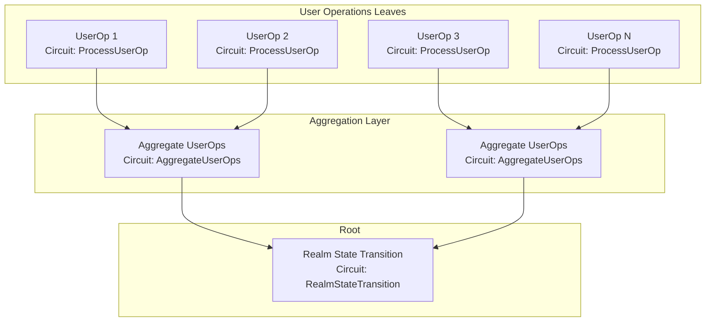
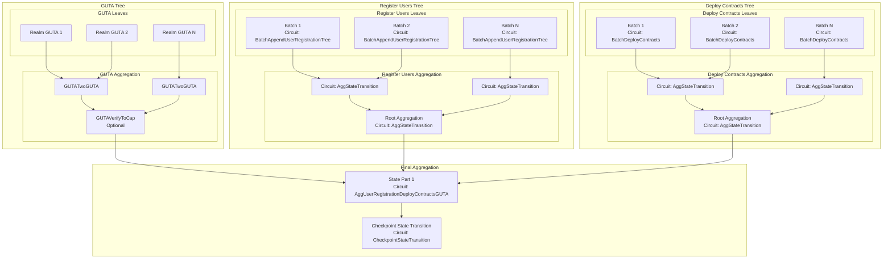
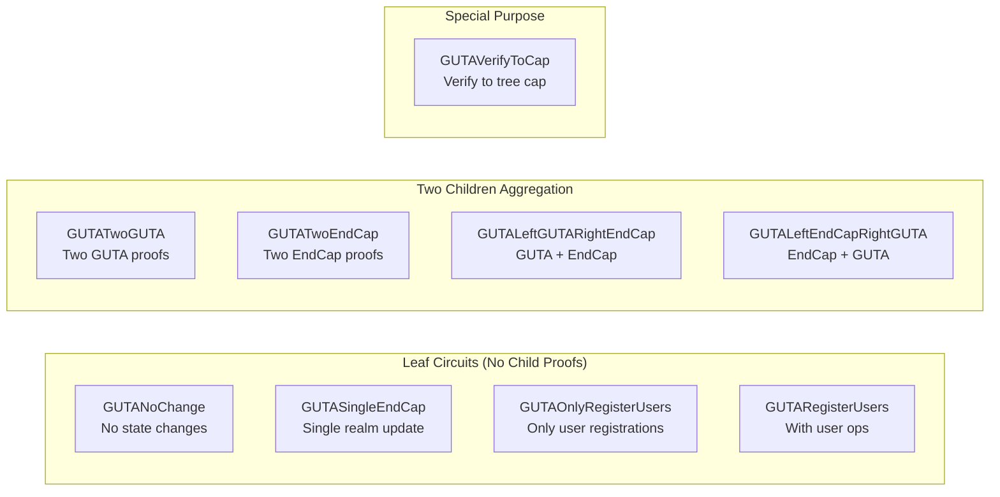
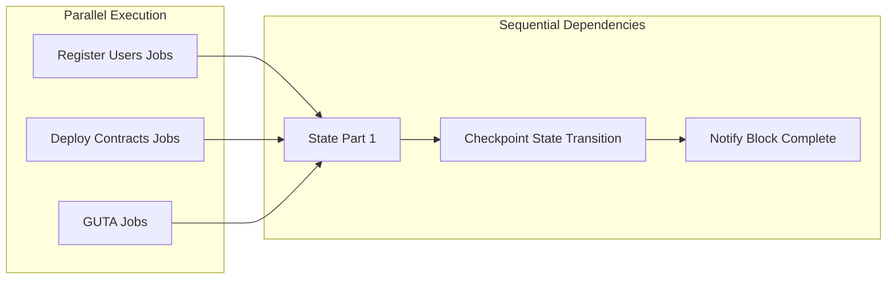

# Proving Jobs Architecture

## Overview

This document describes the proving jobs architecture for both Realm and Coordinator processors, including the tree structure of different proof types and their public inputs layout.

## Public Inputs Layout Standard

All circuits follow a consistent public inputs layout:
- **[0..4]**: commitment
- **[4..8]**: worker_public_key
- **[8..12]**: circuit-specific hash (usually the hash of the main data structure)

## Realm Proving Jobs

### User Operations Tree



### Realm Circuit Details

| Circuit | Type | Public Inputs | Commitment Calculation |
|---------|------|---------------|------------------------|
| ProcessUserOp | Leaf | [0..4]: commitment<br/>[4..8]: worker_public_key<br/>[8..12]: user_op_hash | commitment = worker_public_key |
| AggregateUserOps | Intermediate | [0..4]: commitment<br/>[4..8]: worker_public_key<br/>[8..12]: agg_hash | commitment = hash(left.commitment, right.commitment) |
| RealmStateTransition | Root | [0..4]: commitment<br/>[4..8]: worker_public_key<br/>[8..12]: state_transition_hash | commitment = hash of all child commitments |

## Coordinator Proving Jobs

### Three Main Trees + Final Aggregation



## GUTA Circuit Variants

The GUTA (Global User Tree Aggregator) has multiple circuit variants to handle different scenarios:

### GUTA Circuit Types and Usage



### GUTA Circuit Details

| Circuit | Purpose | Children | Commitment Calculation |
|---------|---------|----------|------------------------|
| **Leaf Circuits** |
| GUTANoChange | No state changes in checkpoint | None | commitment = worker_public_key |
| GUTASingleEndCap | Single realm had updates | None | commitment = worker_public_key |
| GUTAOnlyRegisterUsers | Only user registrations, no ops | None | commitment = worker_public_key |
| GUTARegisterUsers | User registrations with ops | None | commitment = worker_public_key |
| **Aggregation Circuits** |
| GUTATwoGUTA | Aggregate two GUTA proofs | 2 GUTA | commitment = hash(a.commitment, b.commitment) |
| GUTATwoEndCap | Aggregate two EndCap proofs | 2 EndCap | commitment = hash(worker_public_key, worker_public_key)* |
| GUTALeftGUTARightEndCap | GUTA on left, EndCap on right | 1 GUTA + 1 EndCap | commitment = hash(a.commitment, worker_public_key) |
| GUTALeftEndCapRightGUTA | EndCap on left, GUTA on right | 1 EndCap + 1 GUTA | commitment = hash(worker_public_key, b.commitment)* |
| **Special Circuits** |
| GUTAVerifyToCap | Verify GUTA to tree cap | 1 GUTA | commitment = worker_public_key |

*Note: These circuits currently have incorrect commitment calculations that need fixing.

## State Part 1 (AggUserRegistrationDeployContractsGUTA)

This circuit aggregates the three main trees:

### Inputs
- Register Users proof (from aggregation root)
- Deploy Contracts proof (from aggregation root)
- GUTA proof (from aggregation root or GUTAVerifyToCap)

### Public Inputs Layout
- **[0..4]**: state_transition_hash
- **[4..8]**: register_users_root = hash(register_users_proof.commitment, register_users_proof.worker_public_key)
- **[8..12]**: deploy_contracts_root = hash(deploy_contracts_proof.commitment, deploy_contracts_proof.worker_public_key)
- **[12..16]**: gutas_root = hash(guta_proof.commitment, guta_proof.worker_public_key)

### PM Rewards Commitment
The PM (Prover/Miner) Rewards Commitment is calculated from these three roots:
```rust
PMRewardCommitment {
    register_users_root,
    deploy_contracts_root,
    gutas_root,
}
```

## Checkpoint State Transition

The final circuit that creates the checkpoint proof:

### Inputs
- State Part 1 proof
- Previous checkpoint proof
- Checkpoint tree merkle proof
- Various metadata (block time, random seed, etc.)

### Public Inputs
- Checkpoint hash
- New checkpoint tree root
- State transition proof

## Job Dependencies and Task Graph



## Key Design Principles

1. **Consistent Public Inputs**: All circuits follow the same [commitment, worker_public_key, data_hash] layout
2. **Tree Aggregation**: Each category (GUTA, Register Users, Deploy Contracts) forms its own tree
3. **Parallel Processing**: The three trees can be processed in parallel
4. **Commitment Chain**: Commitments flow up from leaves to root, enabling reward distribution
5. **Flexibility**: GUTA circuits handle various scenarios (no changes, single realm, multiple realms)
