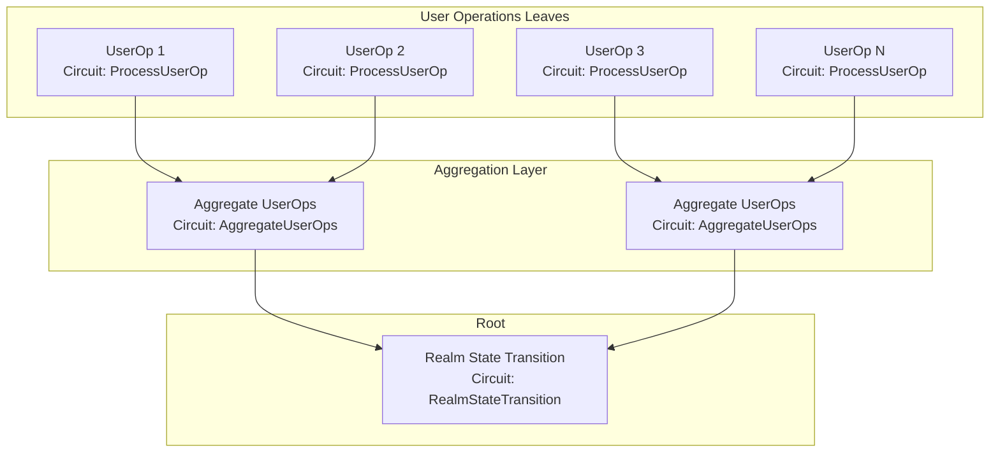
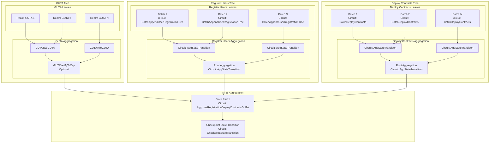
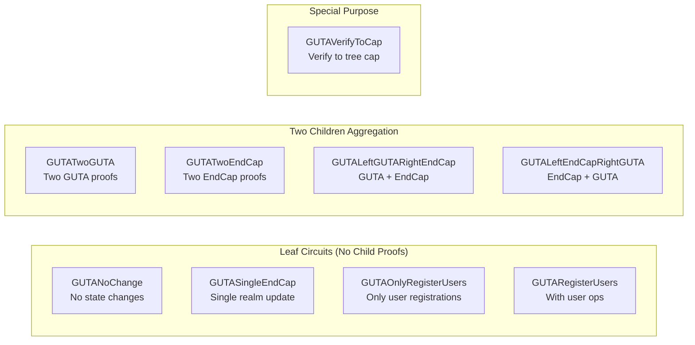

# Proving Jobs Architecture

## Overview

This document describes the proving jobs architecture for both Realm and Coordinator processors, including the tree structure of different proof types and their public inputs layout.

## Public Inputs Layout Standard

All circuits follow a consistent public inputs layout:
- **[0..4]**: commitment
- **[4..8]**: worker_public_key
- **[8..11]**: pm_jobs_completed_stats (deploy_contracts_completed, register_users_completed, gutas_completed)
- **[11..15]**: circuit-specific hash (usually the hash of the main data structure)
- **[15..19]**: additional data (optional, circuit-specific)

## Realm Proving Jobs

### User Operations Tree



### Realm Circuit Details

| Circuit | Type | Public Inputs | Commitment Calculation |
|---------|------|---------------|------------------------|
| ProcessUserOp | Leaf | [0..4]: commitment<br/>[4..8]: worker_public_key<br/>[8..11]: pm_jobs_completed_stats<br/>[11..15]: user_op_hash | commitment = worker_public_key |
| AggregateUserOps | Intermediate | [0..4]: commitment<br/>[4..8]: worker_public_key<br/>[8..11]: pm_jobs_completed_stats<br/>[11..15]: agg_hash | commitment = hash(hash(left.commitment, right.commitment), worker_public_key) |
| RealmStateTransition | Root | [0..4]: commitment<br/>[4..8]: worker_public_key<br/>[8..11]: pm_jobs_completed_stats<br/>[11..15]: state_transition_hash | commitment = hash(hash(children), worker_public_key) |

## Coordinator Proving Jobs

### Three Main Trees + Final Aggregation



## GUTA Circuit Variants

The GUTA (Global User Tree Aggregator) has multiple circuit variants to handle different scenarios:

### GUTA Circuit Types and Usage



### GUTA Circuit Details

| Circuit | Purpose | Children | Public Inputs | Commitment Calculation |
|---------|---------|----------|---------------|------------------------|
| **Leaf Circuits** |
| GUTANoChange | No state changes in checkpoint | None | [0..4]: commitment<br/>[4..8]: worker_public_key<br/>[8..11]: pm_jobs_completed_stats<br/>[11..15]: guta_header_hash | commitment = worker_public_key |
| GUTASingleEndCap | Single realm had updates | None | [0..4]: commitment<br/>[4..8]: worker_public_key<br/>[8..11]: pm_jobs_completed_stats<br/>[11..15]: guta_header_hash | commitment = worker_public_key |
| GUTAOnlyRegisterUsers | Only user registrations, no ops | None | [0..4]: commitment<br/>[4..8]: worker_public_key<br/>[8..11]: pm_jobs_completed_stats<br/>[11..15]: guta_header_hash | commitment = worker_public_key |
| GUTARegisterUsers | User registrations with ops | 1 GUTA | [0..4]: commitment<br/>[4..8]: worker_public_key<br/>[8..11]: pm_jobs_completed_stats<br/>[11..15]: guta_header_hash | commitment = hash(child.commitment, worker_public_key) |
| GUTATwoEndCap | Aggregate two EndCap proofs | None | [0..4]: commitment<br/>[4..8]: worker_public_key<br/>[8..11]: pm_jobs_completed_stats<br/>[11..15]: guta_header_hash | commitment = worker_public_key |
| **Two Children Aggregation** |
| GUTATwoGUTA | Aggregate two GUTA proofs | 2 GUTA | [0..4]: commitment<br/>[4..8]: worker_public_key<br/>[8..11]: pm_jobs_completed_stats<br/>[11..15]: guta_header_hash | commitment = hash(hash(a.commitment, b.commitment), worker_public_key) |
| GUTALeftGUTARightEndCap | GUTA on left, EndCap on right | 1 GUTA + 1 EndCap | [0..4]: commitment<br/>[4..8]: worker_public_key<br/>[8..11]: pm_jobs_completed_stats<br/>[11..15]: guta_header_hash | commitment = hash(hash(a.commitment, b.commitment), worker_public_key) |
| GUTALeftEndCapRightGUTA | EndCap on left, GUTA on right | 1 EndCap + 1 GUTA | [0..4]: commitment<br/>[4..8]: worker_public_key<br/>[8..11]: pm_jobs_completed_stats<br/>[11..15]: guta_header_hash | commitment = hash(hash(a.commitment, b.commitment), worker_public_key) |
| **Single Child Circuits** |
| GUTAVerifyToCap | Verify GUTA to tree cap | 1 GUTA | [0..4]: commitment<br/>[4..8]: worker_public_key<br/>[8..11]: pm_jobs_completed_stats<br/>[11..15]: guta_header_hash | commitment = hash(child.commitment, worker_public_key) |
| GUTAVerifyGUTARegisterUsers | GUTA with user registrations | 1 GUTA | [0..4]: commitment<br/>[4..8]: worker_public_key<br/>[8..11]: pm_jobs_completed_stats<br/>[11..15]: guta_header_hash | commitment = hash(child.commitment, worker_public_key) |

## State Part 1 (AggUserRegistrationDeployContractsGUTA)

This circuit aggregates the three main trees:

### Inputs
- Register Users proof (from aggregation root)
- Deploy Contracts proof (from aggregation root)
- GUTA proof (from aggregation root or GUTAVerifyToCap)

### Public Inputs Layout
- **[0..4]**: commitment
- **[4..8]**: worker_public_key
- **[8..11]**: pm_jobs_completed_stats (combined from all three child proofs)
- **[11..15]**: state_transition_hash
- **[15..19]**: register_users_root (directly from register_users_proof[0..4])
- **[19..23]**: deploy_contracts_root (directly from deploy_contracts_proof[0..4])
- **[23..27]**: gutas_root (directly from guta_proof[0..4])

### PM Rewards Commitment
The PM (Prover/Miner) Rewards Commitment is calculated from these three roots:
```rust
PMRewardCommitment {
    register_users_root,
    deploy_contracts_root,
    gutas_root,
}
```

## Checkpoint State Transition

The final circuit that creates the checkpoint proof:

### Inputs
- State Part 1 proof
- Previous checkpoint proof
- Checkpoint tree merkle proof
- Various metadata (block time, random seed, etc.)

### Public Inputs
- Checkpoint hash
- New checkpoint tree root
- State transition proof

## Job Dependencies and Task Graph

```mermaid
graph LR
    subgraph "Parallel Execution"
        RU[Register Users Jobs<br/>PM Stats: (0, N, 0)]
        DC[Deploy Contracts Jobs<br/>PM Stats: (M, 0, 0)]
        GUTA[GUTA Jobs<br/>PM Stats: (0, 0, K)]
    end

    subgraph "Sequential Dependencies"
        SP1[State Part 1<br/>PM Stats: (M, N, K)]
        CST[Checkpoint State Transition<br/>PM Stats: (M, N, K)]
        NOTIFY[Notify Block Complete]
    end

    RU --> SP1
    DC --> SP1
    GUTA --> SP1
    SP1 --> CST
    CST --> NOTIFY
```

The dependency graph shows how PM stats flow through the system:
1. **Parallel Trees**: Each tree type accumulates its specific job counts
2. **State Part 1**: Combines PM stats from all three trees 
3. **Checkpoint**: Preserves the combined PM stats for final reward calculation
4. **Block Completion**: Uses PM stats to calculate and distribute rewards

## Commitment Calculation Rules

The commitment calculation follows a consistent pattern across all circuits:

### 1. Leaf Circuits (No Child Proofs)
```rust
commitment = worker_public_key
```
Examples: GUTANoChange, BatchDeployContracts, AppendUserRegistrationTree

### 2. Single Child Circuits (One Child Proof)
```rust
commitment = hash(child.commitment, worker_public_key)
```
Examples: GUTAVerifyToCap, GUTAVerifyGUTARegisterUsers

### 3. Two Children Circuits (Two Child Proofs)
```rust
commitment = hash(hash(left.commitment, right.commitment), worker_public_key)
```
Examples: GUTATwoGUTA, AggStateTransition, GUTALeftGUTARightEndCap

### Why This Design?
- **Leaf nodes**: The commitment IS the worker's identity, proving who did the work
- **Aggregation nodes**: The commitment combines children's work with the aggregator's identity
- **Merkle proof generation**: This forms a proper tree structure for generating proofs of participation

## Coordinator Main Circuits

### Register Users Tree Circuits
| Circuit | Type | Children | Public Inputs | Commitment |
|---------|------|----------|---------------|------------|
| AppendUserRegistrationTree | Leaf | None | [0..4]: commitment<br/>[4..8]: worker_public_key<br/>[8..11]: pm_jobs_completed_stats<br/>[11..15]: state_transition_hash | worker_public_key |
| AggStateTransition | Aggregation | 2 | [0..4]: commitment<br/>[4..8]: worker_public_key<br/>[8..11]: pm_jobs_completed_stats<br/>[11..15]: state_transition_hash | hash(hash(left, right), worker_pk) |

### Deploy Contracts Tree Circuits
| Circuit | Type | Children | Public Inputs | Commitment |
|---------|------|----------|---------------|------------|
| BatchDeployContracts | Leaf | None | [0..4]: commitment<br/>[4..8]: worker_public_key<br/>[8..11]: pm_jobs_completed_stats<br/>[11..15]: state_transition_hash | worker_public_key |
| AggStateTransition | Aggregation | 2 | [0..4]: commitment<br/>[4..8]: worker_public_key<br/>[8..11]: pm_jobs_completed_stats<br/>[11..15]: state_transition_hash | hash(hash(left, right), worker_pk) |

### Final Aggregation Circuits
| Circuit | Type | Purpose | Public Inputs |
|---------|------|---------|---------------|
| AggUserRegistrationDeployContractsGUTA | Aggregation | Combines all three trees into State Part 1 | [0..4]: commitment<br/>[4..8]: worker_public_key<br/>[8..11]: pm_jobs_completed_stats<br/>[11..27]: state and root data |
| CheckpointStateTransition | Root | Creates final checkpoint proof | [0..4]: commitment<br/>[4..8]: worker_public_key<br/>[8..11]: pm_jobs_completed_stats<br/>[11+]: checkpoint data |

## PM Jobs Completed Stats Tracking

The PM (Proof Miner) jobs completed stats track the number of different types of jobs completed throughout the circuit hierarchy. These stats flow upward through the trees and are combined at aggregation points.

### PM Stats Components
- **deploy_contracts_completed**: Number of deploy contract jobs completed in this subtree
- **register_users_completed**: Number of user registration jobs completed in this subtree  
- **gutas_completed**: Number of GUTA jobs completed in this subtree

### How Stats Flow Through the Hierarchy

#### Leaf Circuits
Leaf circuits initialize their PM stats based on the work they perform:
- **Deploy Contract leaves** (BatchDeployContracts): `pm_stats = (batch_size, 0, 0)`
- **Register Users leaves** (AppendUserRegistrationTree): `pm_stats = (0, batch_size, 0)` 
- **GUTA leaves** (GUTANoChange, GUTASingleEndCap, etc.): `pm_stats = (0, 0, 0)` initially
- **Dummy circuits** (AggStateTransitionDummy): `pm_stats = (0, 0, 0)` (all zeros)

#### Aggregation Circuits
Aggregation circuits combine PM stats from their children:
```rust
// Two children aggregation (AggStateTransition, GUTATwoGUTA)
final_pm_stats = PMJobsCompletedStats {
    deploy_contracts_completed: left.pm_stats[0] + right.pm_stats[0],
    register_users_completed: left.pm_stats[1] + right.pm_stats[1], 
    gutas_completed: left.pm_stats[2] + right.pm_stats[2],
}
```

#### GUTA Circuits Special Handling
GUTA circuits add 1 to their gutas_completed count:
```rust
// Single child GUTA aggregation (GUTAVerifyToCap)
final_pm_stats = PMJobsCompletedStats {
    deploy_contracts_completed: child.pm_stats[0],
    register_users_completed: child.pm_stats[1],
    gutas_completed: child.pm_stats[2] + 1, // Add 1 GUTA completion
}
```

### Final Aggregation
At the State Part 1 level (AggUserRegistrationDeployContractsGUTA), the PM stats from all three trees are combined:
```rust
final_pm_stats = register_users_proof.pm_stats + 
                 deploy_contracts_proof.pm_stats + 
                 guta_proof.pm_stats
```

This provides a complete count of all work performed in the current checkpoint.

## Key Design Principles

1. **Consistent Public Inputs**: All circuits follow the same [commitment, worker_public_key, pm_jobs_completed_stats, data_hash] layout
2. **Tree Aggregation**: Each category (GUTA, Register Users, Deploy Contracts) forms its own tree
3. **Parallel Processing**: The three trees can be processed in parallel
4. **Commitment Chain**: Commitments flow up from leaves to root, enabling reward distribution
5. **Flexibility**: GUTA circuits handle various scenarios (no changes, single realm, multiple realms)
6. **Worker Tracking**: Every circuit includes the worker's public key who computed that proof
7. **PM Stats Tracking**: Job completion counts flow upward through the tree hierarchy for reward calculation
