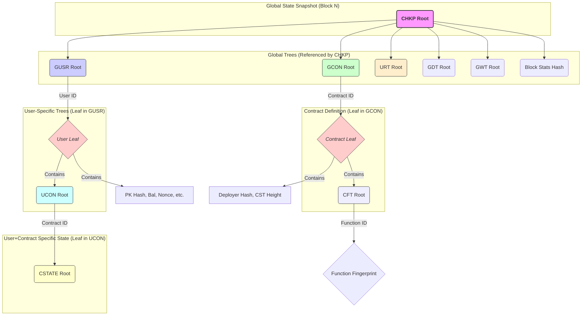
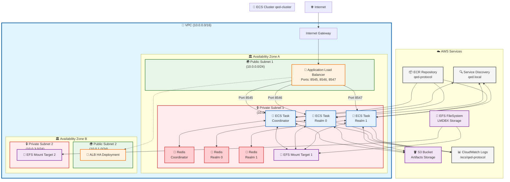

# QED Architecture: Horizontally Scalable Blockchain via PARTH and ZK Proofs

## 1. Introduction: Beyond Sequential Limits

The evolution of blockchain technology has been marked by a persistent challenge: **scalability**. Traditional designs, processing transactions sequentially within a monolithic state machine, hit a throughput ceiling that cannot be overcome simply by adding more network nodes. QED represents a fundamental leap forward, tackling this bottleneck through a revolutionary state architecture known as **PARTH** and a meticulously designed, end-to-end **Zero-Knowledge Proof (ZKP)** system. This architecture unlocks true horizontal scalability, enabling unprecedented transaction processing capacity while maintaining rigorous cryptographic security.

## 2. The PARTH Architecture: A Foundation for Parallelism

PARTH (Parallelizable Account-based Recursive Transaction History) dismantles the concept of a single, conflict-prone global state. Instead, it establishes a granular, hierarchical structure where state modifications are naturally isolated, paving the way for massive parallel processing.

### 2.1 The Hierarchical State Forest

QED's state is not a single tree, but a "forest" of interconnected Merkle trees, each with a specific domain:

*   **`CHKP` (Checkpoint Tree):** The ultimate source of truth for a given block. Its root immutably represents the entire state snapshot, committing to the roots of all major global trees and block statistics. Verifying the `CHKP` root transitively verifies the entire state.
*   **`GUSR` (Global User Tree):** Aggregates all registered users. Each leaf (`ULEAF`) corresponds to a user ID and contains their public key commitment, balance, nonce, last synchronized checkpoint ID, and, crucially, the root of their personal `UCON` tree.
*   **`UCON` (User Contract Tree):** A *per-user* tree mapping Contract IDs to the roots of the user's corresponding `CSTATE` trees. This tree represents the user's state footprint across all contracts they've interacted with.
*   **`CSTATE` (Contract State Tree):** The most granular level. This tree is *specific to a single user AND a single contract*. It holds the actual state variables (storage slots) pertinent to that user within that contract. *This is where smart contract logic primarily operates.*
*   **`GCON` (Global Contract Tree):** Stores global information about deployed contracts via `CLEAF` nodes (Contract Leaf).
*   **`CLEAF` (Contract Leaf):** Contains the deployer's identifier hash, the root of the contract's Function Tree (`CFT`), and the required height (size) for its associated `CSTATE` trees.
*   **`CFT` (Contract Function Tree):** *Per-contract* tree whitelisting executable functions. Maps Function IDs to the ZK circuit fingerprint of the corresponding `DapenContractFunctionCircuit`, ensuring only verified code can be invoked.
*   **`URT` (User Registration Tree):** Commits to user public keys during the registration process, ensuring uniqueness and linking registrations to cryptographic identities.
*   **Other Trees:** Dedicated global trees handle deposits (`GDT`), withdrawals (`GWT`), event data (`EDATA` - conceptually), etc.

### 2.2 PARTH Interaction Rules: Enabling Concurrency

The genius of PARTH lies in its strict state access rules:

1.  **Localized Writes:** A transaction initiated by User A **can only modify state within User A's own trees**. This typically involves changes within one or more of User A's `CSTATE` trees, which then requires updating the corresponding leaves in User A's `UCON` tree, ultimately updating User A's `ULEAF` in the `GUSR`. **Crucially, User A cannot directly alter User B's `CSTATE`, `UCON`, or `ULEAF`.**
2.  **Historical Global Reads:** A transaction can read *any* state from the blockchain (e.g., User B's balance stored in their `ULEAF`, a variable in User B's `CSTATE` via User B's `UCON` root, or global contract data from `GCON`). However, these reads **always access the state as it was finalized in the *previous* block's `CHKP` root.** The current block's ongoing, parallel state changes are invisible to concurrent transactions.

### 2.3 The Scalability Breakthrough: Conflict-Free Parallelism

These rules eliminate the core bottleneck of traditional blockchains:

*   **No Write Conflicts:** Since users only write to their isolated state partitions, transactions from different users within the same block cannot conflict.
*   **No Read-Write Conflicts:** Reading only the previous, immutable block state prevents race conditions where one transaction's read is invalidated by another's concurrent write.
*   **Massively Parallel Execution & Proving:** The PARTH architecture guarantees that the execution of transactions (CFCs) and the generation of their initial proofs (UPS) for different users are independent processes that can run entirely in parallel without requiring locks or complex synchronization.

## 3. End-to-End ZK Proof System: Securing Parallelism

QED employs a multi-layered, recursive ZK proof system to cryptographically guarantee the integrity of every state transition, even those occurring concurrently.

### 3.1 Contract Function Circuits (CFCs) & Dapen (DPN)

*   **Role:** Encapsulate the verifiable logic of smart contracts. They define the allowed state transitions within a user's `CSTATE` for that contract.
*   **Technology:** Developed using high-level languages (TypeScript/JavaScript) and compiled into ZK circuits (`DapenContractFunctionCircuit`) via the **Dapen (DPN)** toolchain.
*   **Execution:** run **locally** during a User Proving Session (UPS). A ZK proof is generated for each CFC execution, attesting that the logic was followed correctly given the inputs and starting state provided in its context.

### 3.2 User Proving Session (UPS)

*   **Role:** Enables users (or their delegates) to locally process a sequence of their transactions for a block, generating a single, compact "End Cap" proof that summarizes and validates their entire session activity.
*   **Process:**
    1.  **Initialization (`UPSStartSessionCircuit`):** Securely anchors the session's starting state to the last globally finalized `CHKP` root and the user's corresponding `ULEAF`.
    2.  **Transaction Steps (`UPSCFCStandardTransactionCircuit`, etc.):** For each transaction:
        *   Verifies the ZK proof of the **locally executed CFC** (from step 3.1).
        *   Verifies the ZK proof of the **previous UPS step** (ensuring recursive integrity).
        *   Proves that the **UPS state delta** (changes to `UCON` root, debt trees, tx count/stack) correctly reflects the verified CFC's outcomes.
    3.  **Finalization (`UPSStandardEndCapCircuit`):** Verifies the last UPS step, verifies the user's ZK signature authorizing the session, checks final conditions (e.g., all debts cleared), and outputs the net state change (`start_user_leaf_hash` -> `end_user_leaf_hash`) and aggregated statistics (`GUTAStats`).
*   **Scalability Impact:** Drastically reduces the on-chain verification burden. Instead of verifying every transaction individually, the network only needs to verify one aggregate End Cap proof per active user per block.

### 3.3 Network Aggregation (Realms, Coordinators, GUTA)

The network takes potentially millions of End Cap proofs and efficiently aggregates them in parallel using a hierarchy of specialized ZK circuits.

*   **Realms:**
    *   **Role:** Distributed ingestion and initial aggregation points for user state changes (`GUSR`), sharded by user ID ranges.
    *   **Function:**
        1.  Receive End Cap proofs from users within their range.
        2.  Verify these proofs using circuits like `GUTAVerifySingleEndCapCircuit` (for individual proofs) or `GUTAVerifyTwoEndCapCircuit` (for pairs). These circuits use the `VerifyEndCapProofGadget` internally to check the End Cap proof validity, fingerprint, and historical checkpoint link, outputting a standardized `GlobalUserTreeAggregatorHeader`.
        3.  Recursively aggregate the resulting GUTA headers using circuits like `GUTAVerifyTwoGUTACircuit`, `GUTAVerifyLeftGUTARightEndCapCircuit`, or `GUTAVerifyLeftEndCapRightGUTACircuit`. These employ `VerifyGUTAProofGadget` to check sub-proofs and `TwoNCAStateTransitionGadget` (or line proof logic) to combine state transitions.
        4.  If necessary, use `GUTAVerifyGUTAToCapCircuit` (which uses `VerifyGUTAProofToLineGadget`) to bring a proof up to the Realm's root level.
        5.  Handle periods of inactivity using `GUTANoChangeCircuit`.
        6.  Submit the final aggregated GUTA proof for their user segment (representing the net change at the Realm's root node in `GUSR`) to the Coordinator layer.
    *   **Scalability Impact:** Distributes the initial proof verification and `GUSR` aggregation load.

*   **Coordinators:**
    *   **Role:** Higher-level aggregators combining proofs *across* Realms and *across* different global state trees.
    *   **Function:**
        1.  Verify aggregated GUTA proofs from multiple Realms (using `GUTAVerifyTwoGUTACircuit` or similar, employing `VerifyGUTAProofGadget`).
        2.  Verify proofs for global operations:
            *   User Registrations (`BatchAppendUserRegistrationTreeCircuit`).
            *   Contract Deployments (`BatchDeployContractsCircuit`).
        3.  Combine these different types of state transitions using aggregation circuits like `VerifyAggUserRegistartionDeployContractsGUTACircuit`, ensuring consistency relative to the same checkpoint.
        4.  Prepare the final inputs for the block proof circuit (`QEDCheckpointStateTransitionCircuit`).
    *   **Scalability Impact:** Manages the convergence of parallel proof streams from different state components and realms.

*   **Proving Workers:**
    *   **Role:** The distributed computational workforce of the network. They execute the intensive ZK proof generation tasks requested by Realms and Coordinators.
    *   **Function:** Stateless workers that fetch proving jobs (circuit type, input witness ID, dependency proof IDs) from a queue, retrieve necessary data from the Node State Store, generate the required ZK proof, and write the result back to the store.
    *   **Scalability Impact:** The core engine of computational scalability. The network's proving capacity can be scaled horizontally simply by adding more (potentially permissionless) Proving Workers.

### 3.4 Final Block Proof Generation

*   **Role:** Creates the single, authoritative ZK proof for the entire block.
*   **Circuit:** `QEDCheckpointStateTransitionCircuit`.
*   **Function:** Takes the final aggregated state transition proofs from the Coordinator layer (representing net changes to `GUSR`, `GCON`, `URT`, etc.). Verifies these proofs. Computes the new global state roots and combines them with aggregated block statistics (`QEDCheckpointLeafStats`) to form the new `QEDCheckpointLeaf`. Proves the correct update of the `CHKP` tree by appending this new leaf hash. **Critically, it verifies that the entire process correctly transitioned from the state defined by the *previous block's finalized `CHKP` root* (provided as a public input).**
*   **Output:** A highly succinct ZK proof whose public inputs are the previous `CHKP` root and the new `CHKP` root.

## 4. Node State Architecture: Redis & KVQ Backend

Supporting this massive parallelism requires a high-performance, shared backend infrastructure.

*   **Core Technology:** QED leverages **Redis**, a distributed in-memory key-value store known for its speed and scalability, as the primary backend. Redis Clusters allow horizontal scaling of storage and throughput.
*   **Abstraction Layer (KVQ):** A custom Rust library providing traits and adapters (`KVQSerializable`, `KVQStandardAdapter`, model types like `KVQFixedConfigMerkleTreeModel`) for structured, type-safe interaction with Redis. It simplifies key generation, serialization, and potentially caching.
*   **Logical Components:**
    *   **Proof Store (`ProofStoreFred`, implements `QProofStore...` traits):** Stores ZK proofs and input witnesses, keyed by `QProvingJobDataID`. Uses Redis Hashes (`HSET`, `HGET`) and potentially atomic counters (`HINCRBY`) for managing job dependencies.
    *   **State Store (Models implementing `QEDCoordinatorStore...`, `QEDRealmStore...` traits):** Stores the canonical blockchain state, primarily Merkle tree nodes (`KVQMerkleNodeKey`) and leaf data (`UserLeaf`, `ContractLeaf`, etc.). Uses standard Redis keys managed via KVQ models.
    *   **Queues (`CheckpointDrainQueue`, `CheckpointHistoryQueue`, `WorkerEventQueue` traits):** Implement messaging between components. Uses Redis Lists (`LPUSH`, `LPOP`/`BLPOP`, `LRANGE`) for job queues and potentially Pub/Sub or simple keys/sorted sets for history tracking and notifications. `ProofStoreFred` often implements these queue interaction traits.
    *   **Local Caching (`QEDCmdStoreWithCache`, used within `QEDLocalProvingSessionStore`):** Provides an in-memory cache layer for frequently accessed state data (e.g., contract definitions, user leaves from the previous block) during local UPS execution or within Realm/Coordinator nodes, reducing load on the central Redis cluster.
*   **Scalability:**
    *   **Redis Performance:** Provides low-latency access required for coordinating many workers.
    *   **Horizontal Scaling:** Redis clusters can scale to handle increased load.
    *   **Concurrency:** Redis handles concurrent connections from numerous DPN nodes.
    *   **Decoupling:** Proving computation (Workers) is separated from state storage and coordination (Redis + Control Nodes), allowing independent scaling.

## 5. Security Guarantees

QED's security rests on multiple pillars:

1.  **ZK Proof Soundness:** Mathematical guarantee that invalid computations or state transitions cannot produce valid proofs.
2.  **Circuit Whitelisting:** State trees (`GUSR`, `GCON`, `CFT`, etc.) can only be modified by proofs generated from circuits whose fingerprints are present in designated whitelist Merkle trees. This prevents unauthorized code execution. Aggregation circuits enforce these checks recursively.
3.  **Recursive Verification:** Each layer of aggregation cryptographically verifies the proofs from the layer below.
4.  **Checkpoint Anchoring:** The final block circuit explicitly links the new state to the previous block's verified `CHKP` root, creating an unbroken chain of state validity.

## 6. Conclusion: A New Era of Blockchain Scalability

QED's architecture is a fundamental departure from sequential blockchain designs. By leveraging the **PARTH state model** for conflict-free parallel execution and securing it with an **end-to-end recursive ZKP system**, QED achieves true horizontal scalability. The intricate dance between local user proving (UPS/CFC), distributed network aggregation (Realms/Coordinators/GUTA), and a scalable backend (Redis/KVQ) allows the network's throughput to grow with the addition of computational resources (Proving Workers), paving the way for decentralized applications demanding high performance and robust security.

---
